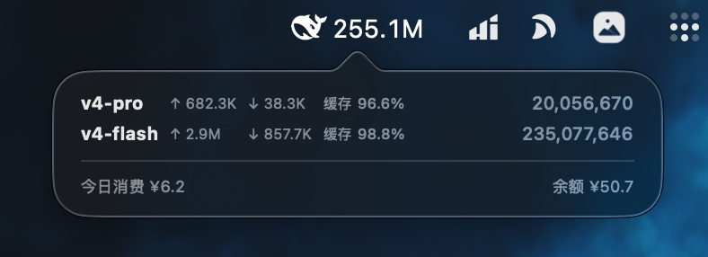

<h1 align="center">DeepSeek Monitor</h1>

  一只住在菜单栏里的小鲸鱼，帮你盯着 DeepSeek API 用量。

  
  
  

  

## 它能做什么

- **Token 用量** — 菜单栏显示总数，弹窗查看各模型明细
- **今日消费** — 每天花了多少钱，一目了然
- **缓存命中率** — 各模型的输入缓存命中百分比

## 开始使用

1. 点击菜单栏鲸鱼图标
2. 点击 **登录 DeepSeek**
3. 完成登录后即刻查看用量

## 许可证

MIT
